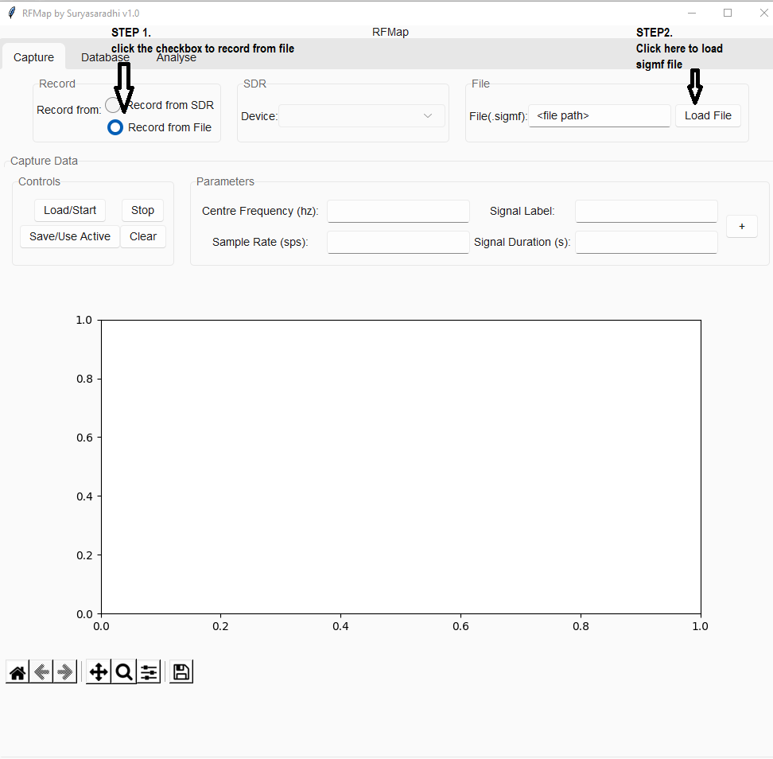
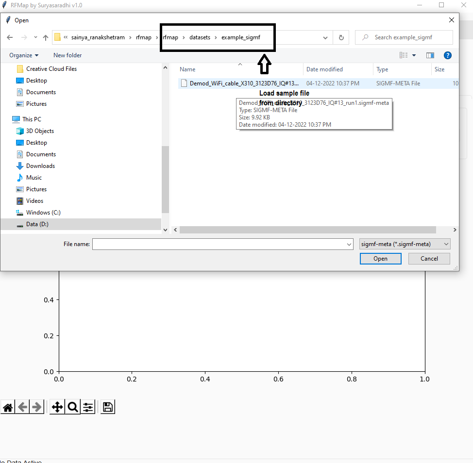
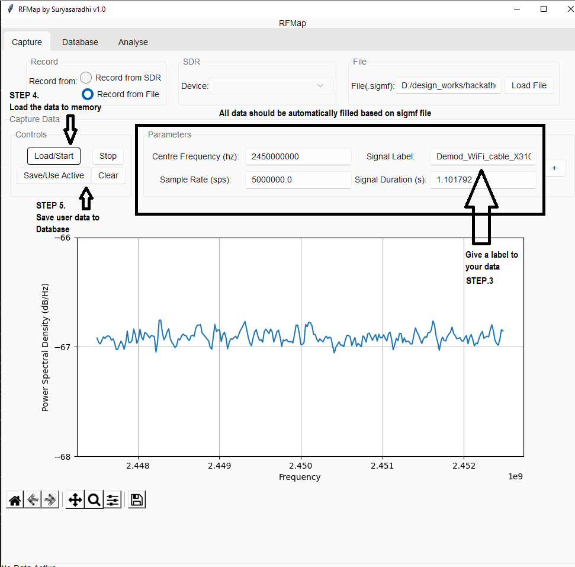
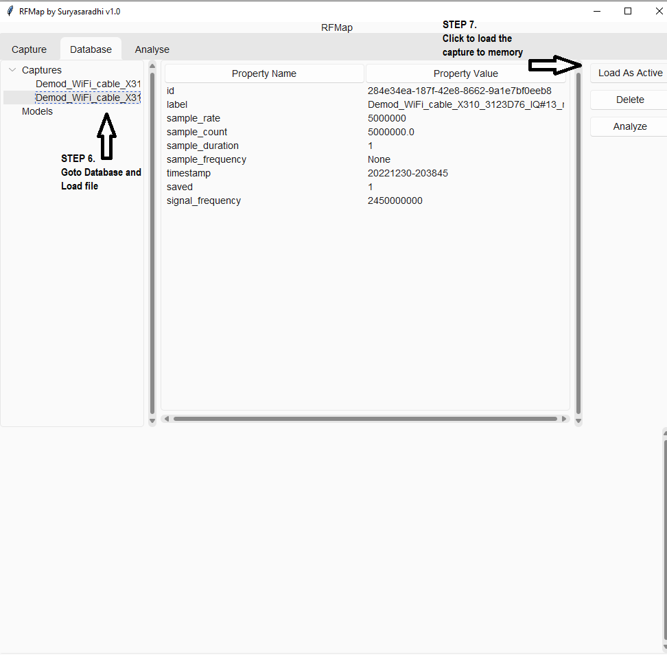
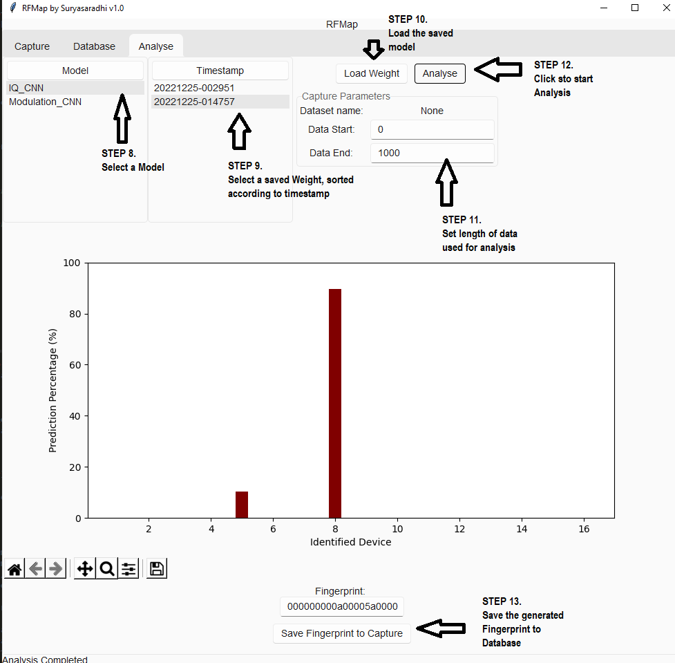

<p align="center">
<a href="" rel="noopener">
<a href="https://ibb.co/wWpqpCK"></a>
</p>

<h1 align="center">RFMap</h1>

<div align="center">

[](https://sainya-ranakshetram.in/)
[]()
[](https://github.com/thesunRider/rfmap/issues)
[](https://github.com/thesunRider/rfmap/pulls)
[](LICENSE.md)

</div>

---

<p align="center"> RF 신호 지문 분석을 돕는 소프트웨어로, 최신 AI 기법을 활용하여 RF (Radio Frequency) 신호를 분류하고 분석합니다.

<br>
이 패키지는 모듈형으로 작성되어 있어 분류 메서드에 새로운 AI '플러그인'을 추가할 수 있습니다. 구현된 AI 논문의 연구 크레딧은 해당 저자들에게 귀속됩니다.

</p>

## 📝 목차

- [문제 정의](docs/Problem_Statement.md)

- [아이디어 및 솔루션](#idea)

- [목표](#objectives)

- [향후 발전 가능성](#future_scope)

- [로컬 환경 설정](#getting_started)

- [사용법](#usage)

- [기술 스택](#tech_stack)

- [기여](docs/Contribution.md)

- [저자](#authors)

- [감사의 말](#acknowledgments)

### 권장사항
최신 릴리스를 위해 [GitHub 링크](https://github.com/thesunRider/rfmap)를 클론하는 것이 좋습니다. 여기는 최신 개발 상태의 저장소가 아니므로 설치/사용 관련 문제는 GitHub에 보고해주세요.

## 🧐 문제 정의 <a name = "problem_statement"></a>

모든 라디오 신호 전송은 제조 과정의 무작위성, 구성 요소의 출처 및 유형 등으로 인해 고유한 특징을 가집니다. 라디오 지문 분석은 신호 전송을 특징짓는 "지문"으로 다른 라디오 송신기를 식별하는 과정이며, 이는 모방이 어렵습니다. 전자 지문은 무선 장치를 라디오 전송 특성으로 식별할 수 있도록 합니다. 라디오 지문 분석은 복제를 방지하기 위해 일반적으로 사용됩니다.

신호가 어느 장치에서 발생했는지를 식별하는 것은 해당 장치와의 인증의 핵심입니다. 현대에는 소프트웨어 계층에서 구현된 보안 조치가 다양한 사이버 프로파일링 기법을 통해 쉽게 위조될 수 있습니다. 출처 장치를 인식하는 데 사용되는 모든 기술은 소프트웨어 계층에서 이루어지며, 이는 제3자가 조작하여 위조 장치를 생성할 수 있습니다. 따라서 하드웨어 수준에서 장치를 인식할 수 있는 기술이 필요합니다. 이 기술은 출처 장치의 고유한 전자 하드웨어 특성을 감지하고 이를 분류할 수 있어야 합니다.

구현된 소프트웨어는 기존에 인식된 송신기 그룹에서 장치 RF 트래픽의 하드웨어 관련 지문을 분류하고 생성할 수 있습니다.

RF 지문 분석은 장치 인증 위조 가능성을 줄이는 핵심 기술입니다. 이는 안전한 통신 채널을 생성하는 데 도움을 줄 것입니다.

## 💡 아이디어 및 구현 <a name = "idea"></a>

RF 지문 분석은 송신기의 하드웨어 결함을 분석하고 이를 분류하여 구현되었습니다. 우리는 다양한 송신기의 IQ 불균형을 92%의 정확도로 예측할 수 있었습니다.

패키지는 모듈형(플러그인 아키텍처)으로 설계되어 송신기 지문 분석을 위한 세 가지 분류기를 패키지에 추가했습니다. 추가 분류기를 프로그래밍 구조 덕분에 쉽게 추가할 수 있습니다.

애플리케이션 자체는 세 가지 섹션으로 구성됩니다:
1. 캡처(Capture)
2. 데이터베이스(Database)
3. 분석(Analysis)

캡처 섹션은 SDR(Software Defined Radio)와 직접 인터페이스하여 IQ 샘플을 수집하거나 sigmf 파일로 캡처된 IQ 샘플을 열 수 있습니다. 캡처된 데이터는 패키지 데이터베이스에 저장됩니다. 이 데이터베이스는 데이터베이스 섹션에서 보고 편집할 수 있으며, 여기에서 분석할 데이터를 메모리에 로드할 수 있습니다. 분석 섹션은 모든 분류기 플러그인을 포함하며, 여기에서 분석할 데이터의 시작 및 종료 인덱스를 입력합니다. 예측 확률은 막대 차트로 나타나며, 이를 기반으로 분석 중인 데이터의 고유 지문이 생성됩니다.

패키지를 위해 세 가지 분류기 플러그인을 구현했습니다:

1. [IQ 유사성 기반 CNN 분류기](docs/Model_Doc_1.md)
   - 유사한 IQ 샘플을 비교하여 위상 차이를 기반으로 지문을 생성합니다.
2. SVM 기반 IQ 지문 분석 (문서 생성 필요, 논문 참조, 구현 완료)
   - 신호에 자기상관을 적용하여 송신기의 고유 지문을 생성합니다.
3. CNN 기반 변조 인식 (문서 생성 필요, 논문 참조, 애플리케이션에 구현 완료)
   - 1번과 유사하게 신호의 유사성을 분석하여 새로운 신호가 속하는 변조 클래스를 결정합니다.

분류기의 메모를 확인하여 자세히 알아보세요. 각 분류기는 분석 대상 장치의 고유 지문을 생성할 수 있습니다. 지문 생성 방식은 다음과 같습니다:

x개의 분류기 예측이 있을 경우, 모든 예측 가능성을 근사치로 반올림하고 가중치 기반 16진수 시프트를 적용하여 최종적으로 고유한 지문을 생성합니다.

```
예: 예측 확률이 P = [1,53,25,18,3]일 경우,
Sum(P) = 100
새로운 P는 가장 가까운 5로 반올림됨
     -> new_P = [0,50,25,20,0]
각 P 요소를 16진수로 변환하여 문자열에 추가함
fingerprint_array = [0x0,0x32,0x19,0x14,0x00]
이 비트를 그룹으로 이동시키면 생성된 지문은:
fingerprint = 0032191400
```

추가 데이터셋을 생성하기 위해 Earth Movers Distance 알고리즘이 적용되어 가우시안 노이즈를 임계값 내에서 생성했습니다.

## ⛓️ 달성한 목표<a name = "objectives"></a>

- [x] 하드웨어 결함을 기반으로 RF 신호를 식별하고 분류하는 애플리케이션 생성 < 문제 정의 >
- [x] 타임스탬프와 함께 지문을 데이터베이스에 저장 < 문제 정의 >
- [x] 파일에서 IQ 샘플 로드
- [x] 플랫폼 독립적인 GUI 및 패키지 설치
- [x] CNN 기반 IQ 분류기 구현
- [x] CNN 기반 변조 분류기 구현
- [ ] SVM 기반 IQ 분류기 구현 (Jupyter 노트북에 구현됨)

핵심 문제 정의 요구사항은 모두 구현되었습니다.

## 🚀 향후 발전 가능성 <a name = "future_scope"></a>

- [ ] 애플리케이션을 SDR과 직접 인터페이스
- [ ] 애플리케이션 내에서 분류기를 훈련
- [ ] 캡처된 RF 신호에 대한 상세한 수동 분석
- [ ] 반복적인 프리앰블 추출기 구현
- [ ] 여러 분류기 지문을 단일 고유 지문으로 결합
- [ ] 분석 진행 모니터링을 위한 GUI 개선
- [ ] 애플리케이션 도커라이징

모듈형 아키텍처 덕분에 추가 기능은 쉽게 구현 가능합니다.

## 🏁 시작하기 <a name = "getting_started"></a>

이 지침은 프로젝트를 로컬 머신에서 개발 및 테스트 목적으로 실행 가능하도록 만듭니다. 패키지 사용 방법은 [Usage](#Usage)를 참조하세요.

### 사전 요구사항

이 패키지는 Python 3.8.5 이상이 필요합니다. 종속성을 설치하려면:

```
pip3 install -r requirements.txt
```

GUI는 Tkinter로 실행되며, 종속성이 플랫폼 독립적이므로 패키지는 크로스 플랫폼으로 실행 가능합니다.

AI 분류기를 실행하려면 GPU가 필요합니다.

## 🎈 사용법 <a name="usage"></a>

패키지는 다음 명령으로 실행됩니다:

```
cd gui/
python3 main.py
```







## ✅ 테스트된 환경

> Windows 10 Home 버전: 10.0.19044 빌드: 19044
> Kali Linux 버전: 6.0.0.1-amd-64

2022년 12월 30일 기준 테스트 완료

## ⛏️ 기술 스택 <a name = "tech_stack"></a>

- [Tensorflow](https://www.tensorflow.org/) - AI
- [Tkinter](https://docs.python.org/3/library/tkinter.html) - GUI 프레임워크
- [h5py](https://www.h5py.org/) - SDR API 및 HDF5 인터페이스

## ✍️ 저자 <a name = "authors"></a>

- [@thesunRider](https://github.com/thesunRider) - 아이디어 및 초기 작업

## 🎉 감사의 말 <a name = "acknowledgments"></a>

- [Aswin vishnu](https://github.com/AswinVishnuA) - AI 모델, 데이터셋 필터링

## 🎓 참고문헌
-  [Radio Frequency Fingerprint Extraction of Radio Emitter Based on I/Q Imbalance](https://doi.org/10.1016/j.procs.2017.03.092)
-  [ORACLE: Optimized Radio clAssification through Convolutional neuraL nEtworks](https://doi.org/10.1109/INFOCOM.2019.8737463)
-  K. Sankhe, M. Belgiovine,F. Zhou, L. Angioloni, F. Restuccia, S. D’Oro, T. Melodia, S. Ioannidis, and K. R. Chowdhury, "No Radio Left Behind: Radio Fingerprinting Through Deep Learning of Physical-Layer Hardware Impairments,” IEEE Transactions on Cognitive Communications and Networking, Special Issue on Evolution of Cognitive Radio to AI-enabled Radio and Networks, 2019.
- [Convolutional Radio Modulation RecognitionNetworks](https://arxiv.org/abs/1602.04105)
- arXiv:2201.00680v3 [cs.LG] 6 Sep 2022
